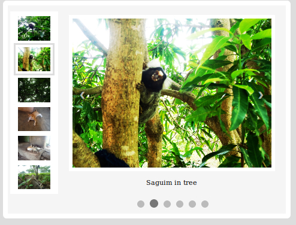

# Engaslider 2.0

Plugin leve e moderno para criação de sliders de imagem responsivos utilizando apenas **JavaScript Puro (Vanilla JS)** e **CSS Puro**, sem nenhuma dependência externa (Zero Dependencies).




---

## 🚀 Novidades na versão 2.0

O projeto foi totalmente reformulado para atender às melhores práticas modernas de desenvolvimento web:
- **Programação Orientada a Objetos (POO)**: Toda a lógica estruturada antiga foi encapsulada na classe ES6 `Engaslider`.
- **Isolamento de Escopo**: Múltiplas instâncias do slider podem rodar na mesma página sem conflitos de variáveis globais.
- **HTML Limpo**: Remoção completa de eventos inline (`onclick`, `onload`). Toda a atribuição de escutas é feita dinamicamente no JS.
- **Temas e Customização com CSS Variables**: O design agora é controlado por propriedades customizadas CSS (`:root`), facilitando a alteração de cores, transições e bordas sem tocar na lógica do script.

---

## 🛠️ Como Utilizar

### 1. Estrutura HTML Necessária
O slider precisa de uma estrutura de classes específicas dentro de um container principal:

```html
<div id="meu-slider-container" class="slider-main-container slider-mold-basic">
    <!-- Miniaturas (Opcional) -->
    <div class="slider-main-thumbnail">
        
        
    </div>

    <!-- Container do Slider Principal -->
    <div class="slider-container">
        <!-- Slides -->
        <div class="slider-image">
            
            <div class="slider-text-caption">Legenda da Imagem 1</div>
        </div>
        <div class="slider-image">
            
            <div class="slider-text-caption">Legenda da Imagem 2</div>
        </div>

        <!-- Botões de Navegação (Anterior/Próximo) -->
        <a class="slider-previous-button">&#10094;</a>
        <a class="slider-next-button">&#10095;</a>

        <!-- Paginação por Dots (Bolinhas) -->
        <div class="slider-dots-nav"></div>
        <div class="slider-dots-nav"></div>
    </div>
</div>
```

### 2. Incluir CSS e JS
Importe os arquivos do Engaslider no seu documento:

```html
<link rel="stylesheet" href="src/slider-min/css/slidershow.css">
<script src="src/slider-min/js/slidershow.js"></script>
```

### 3. Inicializar o Slider
Instancie o slider informando o seletor do container principal e as opções desejadas:

```html
<script>
    document.addEventListener("DOMContentLoaded", function() {
        const slider = new Engaslider("#meu-slider-container", {
            autoplay: true,      // Transição automática (true/false)
            timespeed: 3000      // Tempo por slide em milissegundos (padrão: 3000)
        });
    });
</script>
```

---

## 🎨 Customização de Estilos (CSS Variables)

Você pode personalizar o visual do slider definindo variáveis no seu próprio arquivo CSS ou alterando o `:root` em `slidershow.css`:

```css
:root {
  --slider-bg: whitesmoke;       /* Cor de fundo do container principal */
  --container-bg: white;         /* Cor de fundo do container do slider */
  --dot-bg: #aaa;                /* Cor padrão das bolinhas (dots) */
  --dot-active-bg: #777;         /* Cor da bolinha ativa */
  --button-color: #ffffffa9;     /* Cor das setas de navegação */
  --button-hover-bg: #cecece81;  /* Fundo das setas no hover */
  --thumb-active-border: 3px solid #ddd; /* Borda da miniatura ativa */
}
```

---

## 🧑‍💻 Guia do Desenvolvedor & Extensibilidade

Quer adicionar novos recursos como **navegação por gestos (swipe)**, **controle por setas do teclado**, ou **novas animações de transição**?

Confira o nosso [Guia de Desenvolvimento](docs/developer_guide.md) para ver instruções passo a passo de como estender o Engaslider 2.0.

---

## 📝 Licença

Este projeto é distribuído sob a licença MIT. Consulte o arquivo [LICENSE](LICENSE) para obter mais informações.

Desenvolvido por **Wandeson Ricardo** - [Blog: wsricardo.blogspot.com](https://wsricardo.blogspot.com/search/label/techcodes)

