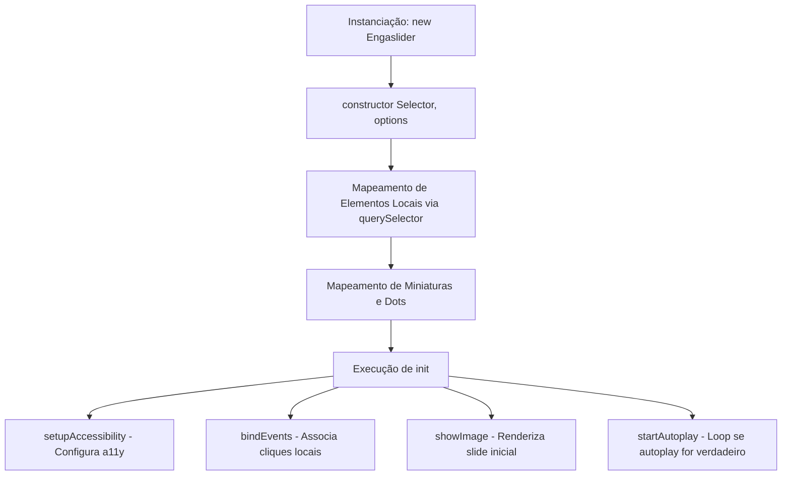

# Guia de Desenvolvimento e Arquitetura: Engaslider 2.0

Este guia foi criado para auxiliar desenvolvedores e colaboradores na manutenção do **Engaslider 2.0** e no desenvolvimento de novos recursos utilizando as diretrizes de arquitetura moderna (Design Headless / Modular).

---

## 1. Arquitetura do Código (JavaScript)

O Engaslider é estruturado utilizando classes ES6 para encapsulamento e isolamento de escopo.

### Mapeamento de Arquivos
- **Script Principal**: [engaslider.js](../src/slider-min/js/engaslider.js) - Contém a definição da classe `Engaslider` com toda a lógica moderna de injeção de eventos dinâmica e suporte ao objeto de configurações.
- **Script Legado**: [slidershow.js](../src/slider-min/js/slidershow.js) - Mantido estritamente para fins de compatibilidade reversa com projetos antigos, emitindo um aviso de depreciação no console.

### Fluxo de Inicialização



### Configurações Aceitas no Construtor

```javascript
const slider = new Engaslider("#container", {
  autoplay: false, // Transição automática (true/false)
  speed: 3000,     // Tempo em milissegundos para transição (padrão: 3000)
  loop: true       // Loop circular infinito de slides (padrão: true)
});
```

---

## 2. API de Integração e Eventos

### A. Escutando Mudanças de Slide (Custom Events)
A cada transição de imagem, a classe despacha um evento customizado chamado `slideChange` contendo o índice atual do slide. Isso possibilita integrações avançadas:

```javascript
const sliderEl = document.querySelector('#meu-slider');
sliderEl.addEventListener('slideChange', (e) => {
    console.log('Slide ativo:', e.detail.activeIndex);
    // Execute código externo aqui (ex: rastrear analytics, carregar legendas, etc.)
});
```

### B. Destruindo Instâncias e Evitando Memory Leaks
Caso o slider seja destruído de forma dinâmica em aplicações SPA, invoque o método `.destroy()` para liberar os listeners de cliques, pausar o autoplay e remover atributos de acessibilidade, prevenindo vazamentos de memória:

```javascript
// Remove listeners e para o autoplay
slider.destroy();
```

---

## 3. Arquitetura CSS Modular (Design Headless)

O visual do slider foi desacoplado de sua estrutura funcional básica em dois arquivos distintos:

### A. Estilo Estrutural: [engaslider-core.css](../src/slider-min/css/engaslider-core.css)
Contém a estruturação essencial (flex layout, posições absolutas de botões, dimensões básicas, etc.) sem cosméticos gráficos. **Não deve ser editado para fins estéticos.**

### B. Estilo Visual (Tema Padrão): [engaslider-theme.css](../src/slider-min/css/engaslider-theme.css)
Contém toda a estilização estética padrão (cores de fundo, bordas, sombras, transições).
Usa variáveis CSS prefixadas para facilitar a customização em nível de projeto:

```css
:root {
  --engaslider-bg-color: whitesmoke;       /* Cor do fundo do container */
  --engaslider-body-bg: #ddd;             /* Cor do body do exemplo */
  --engaslider-container-bg: white;        /* Fundo dos painéis */
  --engaslider-border-color: #adababab;   /* Borda das sombras moldes */
  --engaslider-shadow-color: rgba(7, 7, 7, 0.48); /* Cor da sombra */
  --engaslider-caption-color: black;      /* Cor da legenda */
  --engaslider-button-color: #ffffffa9;   /* Cor das setas de navegação */
  --engaslider-button-hover-bg: rgba(0, 0, 0, 0.4); /* Hover das setas */
  --engaslider-dot-bg: #aaa;              /* Fundo das bolinhas */
  --engaslider-dot-active-bg: #777;       /* Fundo da bolinha ativa */
  --engaslider-thumb-active-border: 3px solid #ddd; /* Borda da miniatura ativa */
}
```

---

## 4. Acessibilidade (a11y) Integrada

O Engaslider atribui dinamicamente os papéis WAI-ARIA correspondentes a um carrossel semântico:
- `role="region"` com `aria-roledescription="carousel"` no container principal.
- `aria-live="polite"` para leitores de tela capturarem a transição de slide.
- `role="button"` e `aria-label` apropriados nas setas e miniaturas.
- `aria-selected` dinâmico nos dots de navegação.

---

## 5. Guias de Extensão para Novos Recursos

Se precisar estender o motor do slider com novos recursos, adicione-os na classe [Engaslider](../src/slider-min/js/engaslider.js):

### A. Adicionando Navegação por Teclado
No método `bindEvents()`, adicione:
```javascript
document.addEventListener("keydown", (e) => {
  if (e.key === "ArrowLeft") this.mvImage(-1);
  if (e.key === "ArrowRight") this.mvImage(1);
});
```

### B. Gestos Mobile (Swipe)
1. Declare no construtor:
```javascript
this.touchStartX = 0;
this.touchEndX = 0;
```
2. Adicione no método `bindEvents()`:
```javascript
this.container.addEventListener("touchstart", (e) => {
  this.touchStartX = e.changedTouches[0].screenX;
}, { passive: true });

this.container.addEventListener("touchend", (e) => {
  this.touchEndX = e.changedTouches[0].screenX;
  this.handleSwipe();
}, { passive: true });
```
3. Adicione o método de validação:
```javascript
handleSwipe() {
  const diff = this.touchEndX - this.touchStartX;
  if (diff < -50) this.mvImage(1);  // Swipe para a esquerda (próximo)
  if (diff > 50) this.mvImage(-1);  // Swipe para a direita (anterior)
}
```
