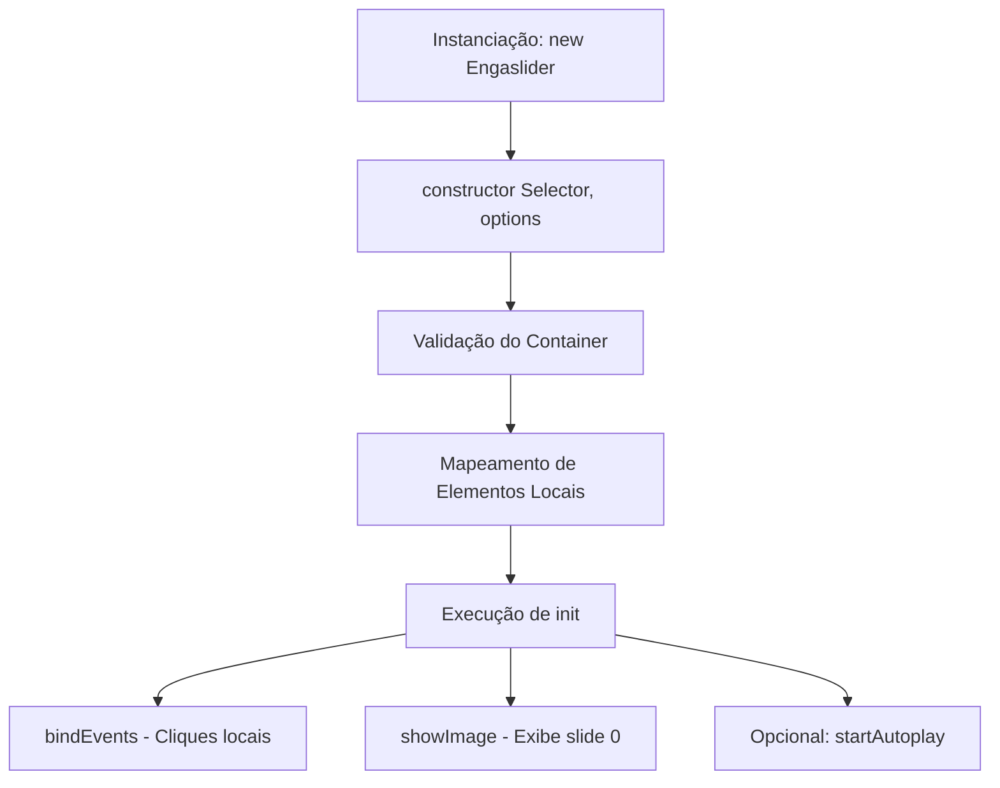

# Guia de Desenvolvimento: Engaslider 2.0

Este guia foi criado para auxiliar desenvolvedores e colaboradores na manutenção do **Engaslider 2.0** e na criação de novos recursos. 

---

## 1. Arquitetura do Código

O Engaslider foi reescrito seguindo o paradigma de **Programação Orientada a Objetos (POO)** com classes ES6. Isso permite o isolamento de escopo completo para que múltiplos sliders coexistam na mesma página sem colisões de variáveis globais.

### Fluxo de Inicialização



### Estrutura do Estado do Objeto

Toda a lógica e referências do slider ficam armazenadas na instância do objeto (`this`):
- `this.container`: O nó HTML principal que engloba o slider.
- `this.slideIndex`: O índice numérico inteiro da imagem atualmente exibida.
- `this.autoplayInterval`: Referência do timer `setInterval` (se `autoplay` for ativo).
- `this.slides`: Lista de elementos com a classe `.slider-image` localizados dentro do container.
- `this.dotsNav`: Lista de dots (`.slider-dots-nav`) locais.
- `this.thumbNav`: Lista de miniaturas (`img`) locais.

---

## 2. Como Estender o Slider (Guias Práticos)

Abaixo estão exemplos estruturados de código de como você pode adicionar novos recursos comuns à classe `Engaslider` no arquivo [slidershow.js](../src/slider-min/js/slidershow.js).

### A. Adicionando Navegação por Teclado
Para permitir que o usuário navegue pelas imagens usando as setas do teclado (esquerda/direita) quando o slider estiver em foco.

**Onde alterar no código:**
No método `bindEvents()`, adicione um escutador global ou focado no container:
```javascript
// Dentro de bindEvents()
document.addEventListener("keydown", (e) => {
  // Apenas navega se o slider estiver visível ou se quiser um comportamento global
  if (e.key === "ArrowLeft") {
    this.mvImage(-1);
  } else if (e.key === "ArrowRight") {
    this.mvImage(1);
  }
});
```

---

### B. Adicionando Suporte a Gestos de Deslizar (Swipe) para Celulares
Para melhorar a experiência em dispositivos mobile usando eventos de toque (`touchstart` e `touchend`).

**Onde alterar no código:**
1. No `constructor`, defina propriedades de controle do toque:
```javascript
this.touchStartX = 0;
this.touchEndX = 0;
```

2. No método `bindEvents()`, capture o início e o fim do toque:
```javascript
// Dentro de bindEvents()
this.container.addEventListener("touchstart", (e) => {
  this.touchStartX = e.changedTouches[0].screenX;
}, { passive: true });

this.container.addEventListener("touchend", (e) => {
  this.touchEndX = e.changedTouches[0].screenX;
  this.handleSwipe();
}, { passive: true });
```

3. Crie o método auxiliar `handleSwipe()` na classe:
```javascript
handleSwipe() {
  const threshold = 50; // Distância mínima do deslize em pixels
  const swipeDistance = this.touchEndX - this.touchStartX;
  
  if (swipeDistance < -threshold) {
    this.mvImage(1); // Deslizou para a esquerda (próximo)
  } else if (swipeDistance > threshold) {
    this.mvImage(-1); // Deslizou para a direita (anterior)
  }
}
```

---

### C. Pausar Rotação ao Passar o Mouse (Pause on Hover)
Para pausar o autoplay temporariamente quando o usuário coloca o ponteiro do mouse sobre o slider.

**Onde alterar no código:**
No método `bindEvents()`:
```javascript
// Dentro de bindEvents()
if (this.options.autoplay) {
  this.container.addEventListener("mouseenter", () => this.stopAutoplay());
  this.container.addEventListener("mouseleave", () => this.startAutoplay());
}
```

---

### D. Adicionando Efeitos de Transição CSS Personalizados
Atualmente, o efeito é controlado pela animação `fade` no CSS. Se você quiser criar outros efeitos (ex: deslizar horizontalmente `slide` ou zoom), siga os passos abaixo:

1. **Defina a animação no CSS** ([slidershow.css](../src/slider-min/css/slidershow.css)):
```css
@keyframes slide-in {
  from { transform: translateX(100%); }
  to { transform: translateX(0); }
}

.slider-image.slide-effect img {
  animation-name: slide-in;
  animation-duration: 0.5s;
}
```

2. **Permita configurar a animação via opções no JS**:
No `constructor`, adicione uma propriedade padrão `transitionEffect`:
```javascript
this.options = {
  autoplay: options.autoplay !== undefined ? options.autoplay : false,
  timespeed: options.timespeed || 3000,
  effect: options.effect || 'fade', // novo parâmetro
  ...options
};
```

3. **Aplique o efeito ao exibir a imagem** em `showImage()`:
```javascript
this.slides.forEach((slide, index) => {
  if (index === this.slideIndex) {
    slide.style.display = "block";
    // Remove classes de efeitos antigos e aplica o selecionado
    slide.classList.remove("fade-effect", "slide-effect");
    slide.classList.add(`${this.options.effect}-effect`);
  } else {
    slide.style.display = "none";
  }
});
```

---

## 3. Padrão de Estilo e Convenções
- **Zero Dependências**: O projeto deve continuar rodando com Vanilla JS e CSS puro.
- **Manipulação de DOM Limpa**: Evite injetar regras de estilo (`style.backgroundColor = ...`) diretamente via JS. Prefira gerenciar adicionando/removendo classes CSS (`element.classList.add('className')`) e deixando o CSS lidar com a representação gráfica.
- **Acessibilidade**: Sempre adicione atributos `alt` descritivos às tags `` e preveja focos de teclado para leitores de tela nos botões de controle (`<a>` ou `<button>`).
